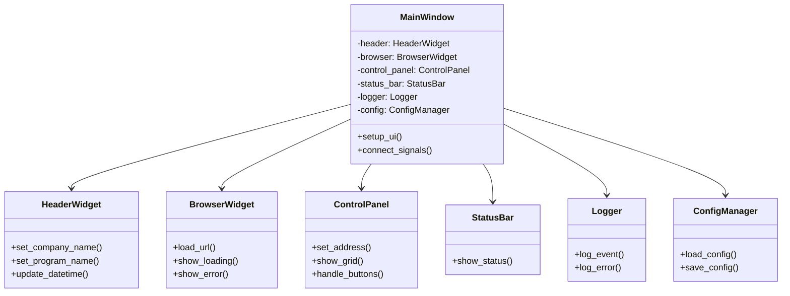

# In-Sight HostUI 클래스 다이어그램

```mermaid
classDiagram
    class MainWindow {
      -header: HeaderWidget
      -browser: BrowserWidget
      -control_panel: ControlPanel
      -status_bar: StatusBar
      -logger: Logger
      -config: ConfigManager
      +setup_ui()
      +connect_signals()
    }
    class HeaderWidget {
      +set_company_name()
      +set_program_name()
      +update_datetime()
    }
    class BrowserWidget {
      +load_url()
      +show_loading()
      +show_error()
    }
    class ControlPanel {
      +set_address()
      +show_grid()
      +handle_buttons()
    }
    class StatusBar {
      +show_status()
    }
    class Logger {
      +log_event()
      +log_error()
    }
    class ConfigManager {
      +load_config()
      +save_config()
    }
    MainWindow --> HeaderWidget
    MainWindow --> BrowserWidget
    MainWindow --> ControlPanel
    MainWindow --> StatusBar
    MainWindow --> Logger
    MainWindow --> ConfigManager
``` 