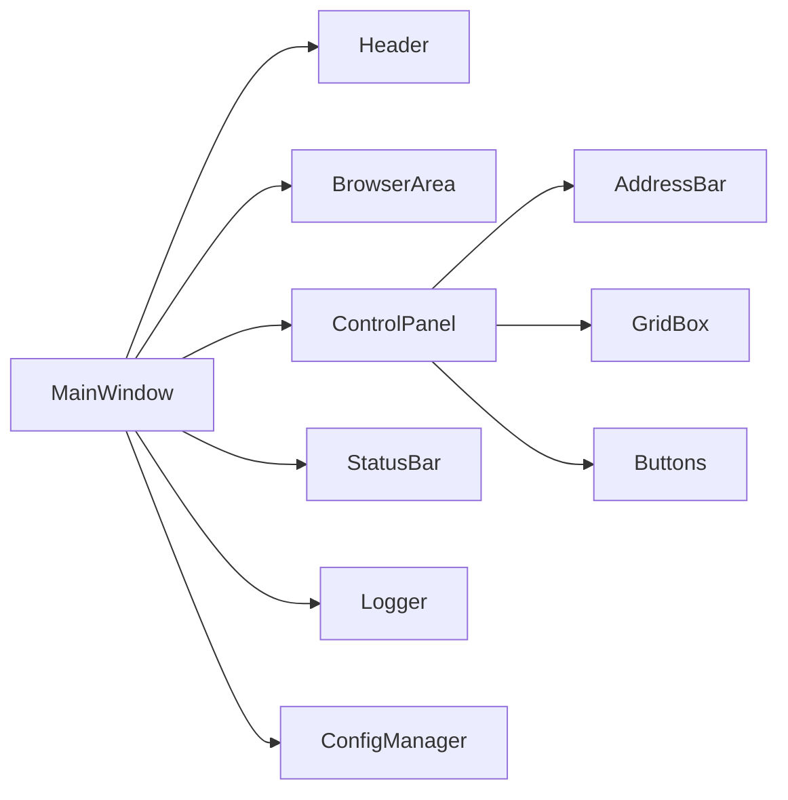

# In-Sight HostUI 설계 문서 (1차 초안)

**버전:** 0.1  
**작성일:** 2024-06-08

---

## 1. 시스템 개요
- Cognex In-Sight 검사 이미지를 모니터링하는 Windows 데스크탑 애플리케이션
- PyQt5/6 기반, 내장 웹브라우저 및 상태/로그/설정 기능 포함

---

## 2. 전체 아키텍처 다이어그램

---

## 3. 주요 컴포넌트 설계

### 3.1 메인 윈도우
- QMainWindow 기반, QHBoxLayout으로 3분할
- 좌측 2/3: BrowserArea (QWebEngineView)
- 우측 1/3: ControlPanel (주소창, 그리드, 버튼)
- 상단: Header (회사명, 프로그램명, 날짜/시간)
- 하단: StatusBar (상태 메시지)

### 3.2 Header
- QHBoxLayout, QLabel(회사명/프로그램명/날짜시간), QTimer로 실시간 갱신

### 3.3 BrowserArea
- QWebEngineView로 In-Sight 웹페이지 표시
- 고정 주소 자동 접속, 로딩/에러/성공 상태 표시

### 3.4 ControlPanel
- QLineEdit(주소), QTableWidget(그리드), QPushButton(기능 버튼)

### 3.5 StatusBar/Logger
- QStatusBar에 상태 메시지 출력
- logging 모듈로 파일/콘솔 로그 기록

### 3.6 설정/언어
- configparser/json으로 설정 관리
- Qt Linguist(.ts/.qm)로 다국어 지원

---

## 4. 데이터/설정 파일 구조
- config/config.ini 또는 config.json: 언어, 주소 등 설정
- logs/app.log: 접속/이벤트/에러 로그
- resources/: icons, styles, html 등 리소스 파일

---

## 5. 예외 처리 및 로깅
- 모든 파일/네트워크/외부 호출에 try-except 적용
- 사용자 안내(QMessageBox), 상세 로그 기록(logging)

---

## 6. 확장성/유지보수 고려
- UI/로직 분리(MVC 구조)
- 설정/로그/리소스 별도 관리
- 기능 확장(다중 장비, 추가 UI 등) 용이

---

## 7. 기타(리소스, 배포 등)
- PyInstaller로 단일 실행파일 빌드
- 리소스 경로(Windows 호환) 주의
- README, 사용자 매뉴얼, PRD 등 문서화

---

화이팅! 