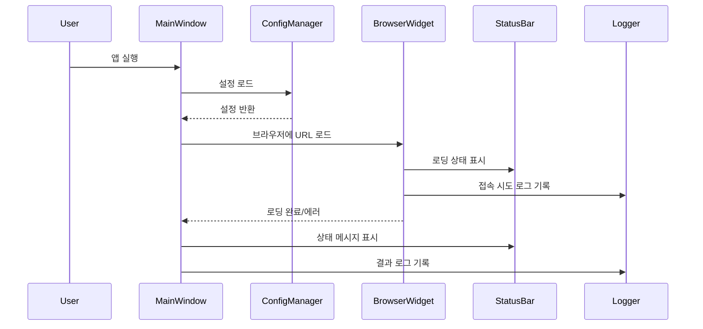

# In-Sight HostUI 시퀀스 다이어그램

```mermaid
sequenceDiagram
    participant User
    participant MainWindow
    participant ConfigManager
    participant BrowserWidget
    participant StatusBar
    participant Logger

    User->>MainWindow: 앱 실행
    MainWindow->>ConfigManager: 설정 로드
    ConfigManager-->>MainWindow: 설정 반환
    MainWindow->>BrowserWidget: 브라우저에 URL 로드
    BrowserWidget->>StatusBar: 로딩 상태 표시
    BrowserWidget->>Logger: 접속 시도 로그 기록
    BrowserWidget-->>MainWindow: 로딩 완료/에러
    MainWindow->>StatusBar: 상태 메시지 표시
    MainWindow->>Logger: 결과 로그 기록
``` 