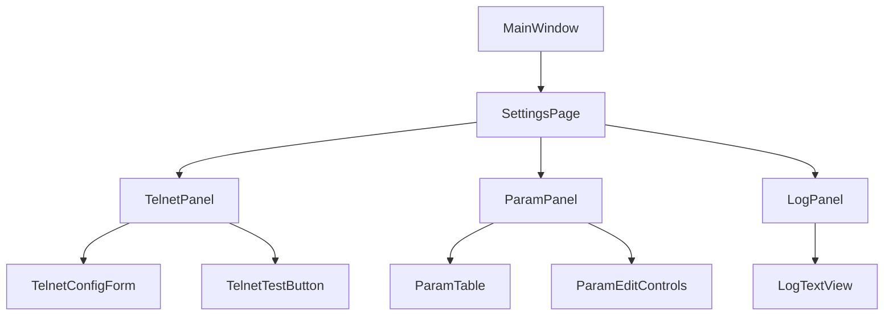

# 설정 페이지 설계 문서 (초안)

**버전:** 0.1  
**작성일:** 2024-06-08

---

## 1. 개요
- 사용자 환경설정, Telnet 통신 설정/테스트, 검사 파라미터 관리 등 요구사항을 충족하는 설정 페이지 설계
- 확장성, 유지보수성, 다국어 지원 고려

---

## 2. 전체 구조 및 아키텍처

- **SettingsPage**: 3분할 레이아웃(좌: Telnet, 중: 파라미터, 우: 로그)
- **TelnetPanel**: Telnet 서버 주소/포트 입력, 연결/해제/테스트 버튼, 통신 데이터 지정
- **ParamPanel**: 검사 파라미터/결과 그리드, 추가/수정/삭제
- **LogPanel**: 통신 및 설정 변경 로그 출력

---

## 3. 주요 컴포넌트 설계

### 3.1 TelnetPanel
- Telnet 서버 주소/포트 입력(QLineEdit)
- 연결/해제/테스트 버튼(QPushButton)
- 통신 데이터 입력/지정(그리드/텍스트)
- 통신 상태/결과 표시(Label)

### 3.2 ParamPanel
- 검사 파라미터/결과 그리드(QTableWidget)
- 파라미터 추가/수정/삭제 버튼
- 파라미터 값 입력/수정(그리드/폼)

### 3.3 LogPanel
- 로그 출력(QTextEdit, 읽기 전용)
- 설정 변경/통신 로그 실시간 출력

---

## 4. UI/로직 분리 및 데이터 흐름
- UI: PyQt5 위젯/레이아웃, 각 Panel별 독립 클래스
- 로직: Telnet 통신, 파라미터 관리, 파일 입출력, 다국어 등은 별도 모듈/클래스
- 신호/슬롯(event)로 UI와 로직 연결
- 설정값은 CSV 파일로 저장/불러오기

---

## 5. 확장성/유지보수 고려
- Panel별 독립적 구현(MVC 구조)
- 설정 항목/언어/기능 추가 용이
- 다국어 지원(Qt Linguist 등 활용)

---

## 6. 기타(테스트, 배포 등)
- 단위 테스트: 각 Panel/로직별 테스트 코드 작성
- 배포: PyInstaller 등으로 단일 실행파일 빌드

---

> 이 문서는 개발 진행에 따라 계속 확장/보완됩니다.

화이팅! 